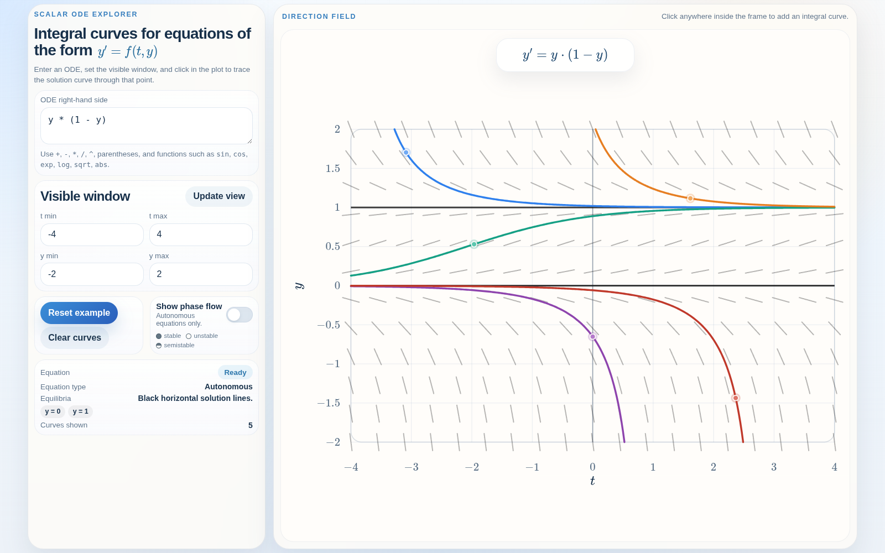

# Integral Curve Explorer

An interactive browser-based explorer for scalar first-order ordinary differential equations of
the form $y' = f(t,y)$. It renders a direction field over a user-chosen $(t,y)$
window, lets you click to trace solutions to the initial value problem $y(t_0) = y_0$, and
highlights equilibrium solutions $y(t) \equiv c$ for autonomous equations
$y' = g(y)$.

Example view for $y' = y(1-y)$ with several integral curves:

